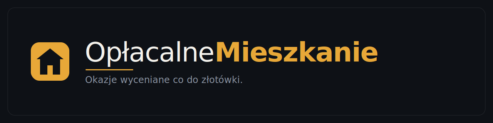
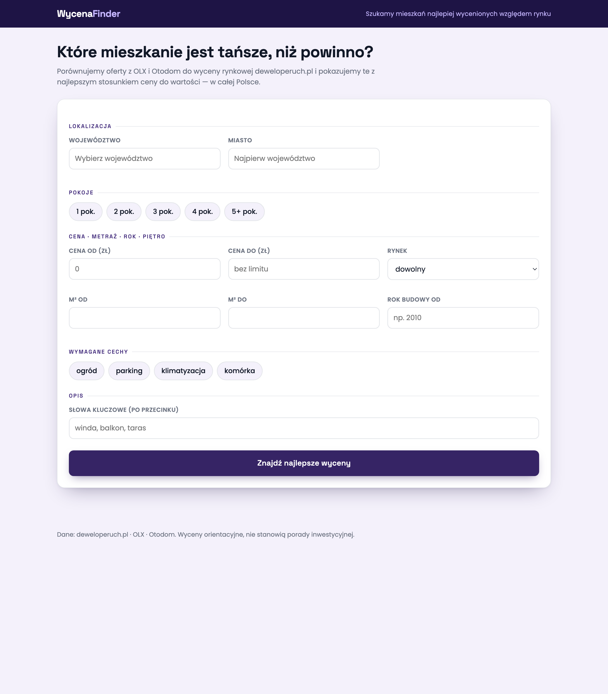
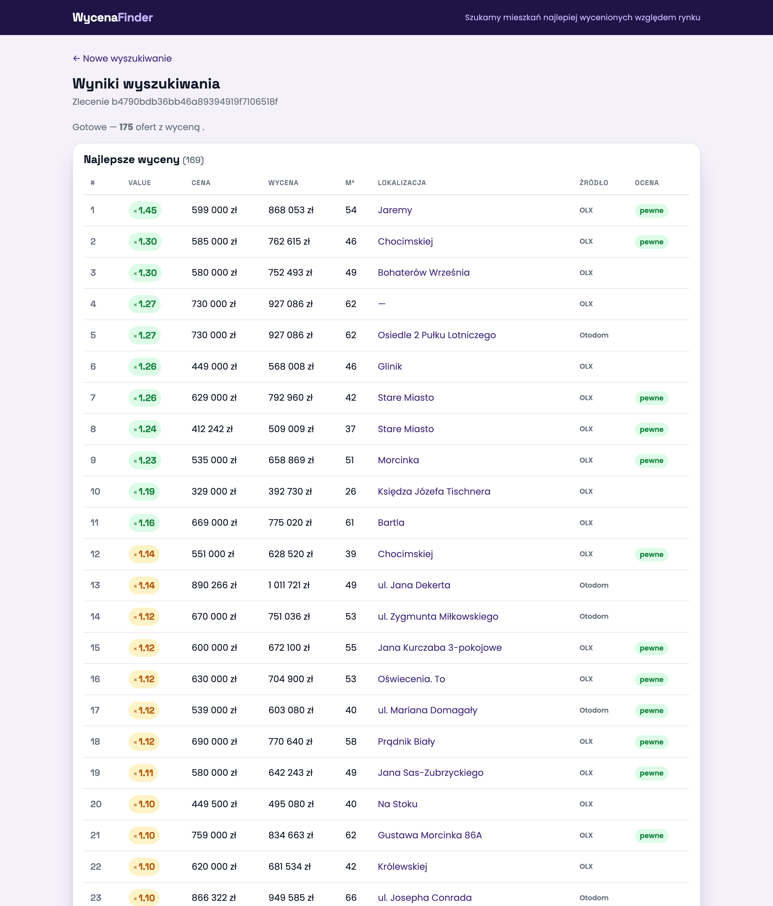

<p align="center">
  
</p>

<p align="center">
  <b>Szukasz mieszkania, które faktycznie jest okazją — nie tylko tanie, ale tanie <i>względem realnej wartości</i>.</b><br>
  OpłacalneMieszkanie zbiera oferty z OLX i Otodom, wycenia każdą przez <code>deweloperuch.pl</code> i układa ranking po opłacalności.
</p>

<p align="center">
  <a href="https://oplacalne-mieszkanie.onrender.com/"><b>▶ &nbsp;Demo na żywo &nbsp;—&nbsp; oplacalne-mieszkanie.onrender.com</b></a><br>
  <sub>darmowy hosting · pierwsze wejście budzi instancję (~30 s)</sub>
</p>

<p align="center">
  
  
  
  
  
</p>

<p align="center">
  <a href="https://codespaces.new/szepix/OplacalneMieszkanie">
    
  </a>
</p>

---

## Co to jest

Portal webowy do polowania na okazje mieszkaniowe. Podajesz województwo, miasto,
opcjonalnie dzielnicę, liczbę pokoi, widełki cenowe i cechy (ogród, parking,
winda…). Aplikacja:

1. **Zbiera** oferty z OLX i Otodom dla zadanego obszaru.
2. **Wycenia** każdą ofertę przez `deweloperuch.pl` (realna wartość rynkowa m²).
3. **Liczy opłacalność** — o ile cena ofertowa odbiega od wyceny.
4. **Ranguje** wyniki: najlepsze okazje na górze, z flagą `reliable`/`suspect`.

Robota leci w tle (kolejka zadań), a interfejs odpytuje status przez HTMX, więc
przeglądarka nie wisi na czas scrapingu.

## Zrzuty ekranu

Formularz wyszukiwania — lokalizacja, pokoje, cena, metraż, cechy, słowa kluczowe:

<p align="center"></p>

Wyniki dla Krakowa (2–3 pokoje, 300–900 tys. zł) — ranking po opłacalności
(`VALUE` = ile razy wycena przewyższa cenę), ze źródłem i flagą wiarygodności:

<p align="center"></p>

## Jak to działa

```
przeglądarka ──POST /search──▶ web (FastAPI)
                                  │  rezerwuje limit per-IP, tworzy zlecenie
                                  └──enqueue──▶ Redis (kolejka RQ)
                                                   │
                                   worker(y) ◀─────┘  pobiera zlecenie
                                       │
                                       ├─ OLX  ‖ Otodom   (równolegle)
                                       ├─ wycena deweloperuch.pl + Nominatim
                                       └─ zapis wyników ──▶ PostgreSQL
                                                                │
              przeglądarka ◀──HTMX poll /job/{id}/status───────┘
```

Cały ruch wychodzący przechodzi przez **wspólny throttle** (token-bucket w Redis,
osobny dla każdej domeny), dzięki czemu można dokładać workery bez ryzyka bana.

## Architektura

| Komponent | Rola |
|-----------|------|
| `web/` | FastAPI + HTMX — formularz, kaskadowe geo (woj→miasto→dzielnica), polling statusu, render wyników. Bezstanowy → `uvicorn --workers N`. |
| `worker/` | Worker RQ. Pobiera zlecenia z kolejki, woła pipeline, zapisuje wyniki. Bezstanowy → skala przez `--scale worker=N`. |
| `jobs/` | Kolejka RQ + limit per-IP (1 aktywne zlecenie, 20/dobę). |
| `pipeline/` | Rdzeń: scraping (`sources/olx.py`, `sources/otodom.py`), geo, wycena, **throttle**. Działa też samodzielnie z CLI, bez Redis. |
| `db/` | SQLAlchemy + PostgreSQL. Cache wyceny (24h) i cache „plastra" wyników (6h) deduplikują pracę. |
| Redis | Broker kolejki + token-buckety throttle + liczniki limitu per-IP. |

## Skalowalny throughput

Sednem jest **rozdzielenie liczby workerów od tempa zapytań do serwisów**.

- **Warstwa kolejki** (workery RQ) skaluje się poziomo za darmo — dokładasz procesy.
- **Warstwa wychodząca** (OLX/Otodom/Nominatim/deweloperuch.pl) to twardy sufit:
  N workerów = N× zapytań = ban. Dlatego **wspólny token-bucket w Redis** trzyma
  globalne, per-domenowe tempo — 1 worker i 50 workerów pukają do OLX tak samo
  grzecznie.

Dodatkowo:

- **Równoległy fetch w zleceniu** — OLX i Otodom lecą jednocześnie (różne buckety),
  zlecenie kończy się szybciej i zwalnia workera.
- **Fail-open + bezpiecznik** — gdy Redis padnie, throttle przepuszcza ruch (grzeczność
  spada, scraping nie staje) i nie obciąża każdego żądania ponownym łączeniem.
- **Limit Nominatim 1 req/s** jest teraz egzekwowany globalnie, zgodnie z ich polityką.

Skalowanie to przekręcenie gałki:

```bash
docker compose up --build --scale worker=4   # 4 workery, tempo wychodzące bez zmian
WEB_WORKERS=4 docker compose up --build       # 4 procesy web
```

Pula proxy / rotacja IP są przygotowane jako *szew* (jedno miejsce w `pipeline/http.py`),
ale celowo niezbudowane — YAGNI do czasu realnych banów.

## Uruchomienie

### GitHub Codespaces (jednym kliknięciem)

Kliknij **Open in GitHub Codespaces** powyżej (albo `Code ▸ Codespaces ▸ Create`
w repo). GitHub zbuduje obraz, wystartuje cały `docker compose` (web + worker +
Postgres + Redis) i przekieruje port `8888` na tymczasowy publiczny URL —
działająca instancja bez konfiguracji lokalnej. To środowisko demonstracyjne,
nie stały hosting (Codespace usypia po bezczynności).

### Docker (pełny stack)

```bash
docker compose up --build        # web na http://localhost:8888 + worker + postgres + redis
```

### Lokalnie (host Postgres + Redis na domyślnych portach)

```bash
python -m pip install -r requirements.txt
docker compose up -d postgres redis        # albo własne usługi
uvicorn web.app:app --reload               # http://localhost:8000
python -m worker.run                       # w drugim terminalu
```

### CLI (bez portalu, bez Redis)

```bash
python3 -m pipeline.cli --woj malopolskie --miasto krakow --rooms 3,4 \
        --features ogrod,parking --keywords winda [--geocode]
```

## Konfiguracja

Wszystko przez zmienne środowiskowe (sensowne domyślne w `config.py`):

| Zmienna | Domyślnie | Opis |
|---------|-----------|------|
| `DATABASE_URL` | `postgresql+psycopg://wf:wf@localhost:5432/wf` | Połączenie do Postgres |
| `REDIS_URL` | `redis://localhost:6379/0` | Redis (kolejka + throttle + limity) |
| `OLX_RATE` | `2.0` | Zapytania/s do OLX (globalnie) |
| `OTODOM_RATE` | `1.0` | Zapytania/s do Otodom |
| `NOMINATIM_RATE` | `1.0` | Zapytania/s do Nominatim (polityka = max 1) |
| `DEWELOPERUCH_RATE` | `2.0` | Zapytania/s do deweloperuch.pl |
| `THROTTLE_BURST` | `3.0` | Wielkość bucketa (chwilowy zryw) |
| `THROTTLE_MAX_WAIT` | `30.0` | Maks. oczekiwanie na token (s) |
| `FETCH_CONCURRENCY` | `4` | Wątki fetchu w jednym zleceniu |
| `WEB_WORKERS` | `2` | Procesy uvicorn |
| `DB_POOL_SIZE` / `DB_MAX_OVERFLOW` | `10` / `20` | Pula połączeń SQLAlchemy |
| `SLICE_TTL_SECONDS` | `21600` | TTL cache wyników (6h) |
| `VALUATION_TTL_SECONDS` | `86400` | TTL cache wyceny (24h) |
| `RATE_ACTIVE_TTL` / `RATE_DAILY_LIMIT` | `300` / `20` | Limit per-IP |
| `MAX_PAGES` | `2` | Stron na źródło |

## Testy

Testy uderzają w **realny stack** — prawdziwy Redis, Postgres i HTTP; nic, co
testujemy, nie jest zamockowane.

```bash
pytest -m "not e2e"     # szybki zestaw (potrzebny Redis + Postgres)
pytest -m e2e           # pełna podróż użytkownika po realnej sieci
```

Wyróżnione:

- `tests/test_throttle.py` — token-bucket: zryw, dopełnianie, bezpiecznik, fail-open.
- `tests/test_throttle_load.py` — wiele równoległych żądań HTTP realnie ograniczonych tempem.
- `tests/test_e2e_journey.py` — równoległe zlecenia od wielu „użytkowników" kończą się
  poprawnie przy wspólnym throttle.

Testy używają DB `wf_test` i Redis db 1 (tworzone automatycznie).

## Struktura

```
web/        FastAPI + szablony HTMX
worker/     worker RQ + instalacja throttle
jobs/       kolejka + limit per-IP
pipeline/   scraping, geo, wycena, throttle (rdzeń, działa solo)
db/         modele, sesja, cache (SQLAlchemy + Postgres)
tests/      testy na realnym stacku
```

## Ograniczenia

- Builder URL-i Otodom zakłada, że miasto jest własnym powiatem (działa dla dużych
  miast; mniejsze miejscowości potrafią zwrócić tylko wyniki z OLX).
- Pula proxy / rotacja IP: tylko przygotowany szew, brak implementacji.
- Cap tempa jest „miękki" przy ekstremalnym przeciążeniu (po `THROTTLE_MAX_WAIT`
  żądanie i tak idzie, żeby nie wywrócić zlecenia użytkownika).
